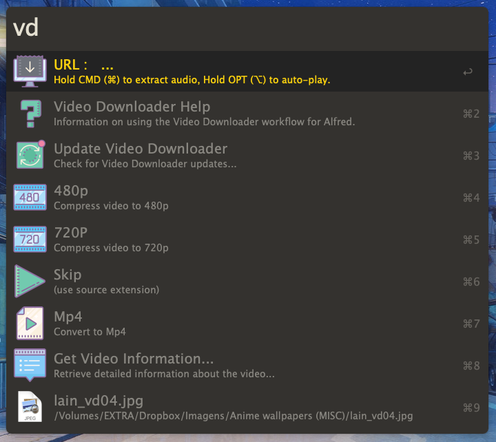
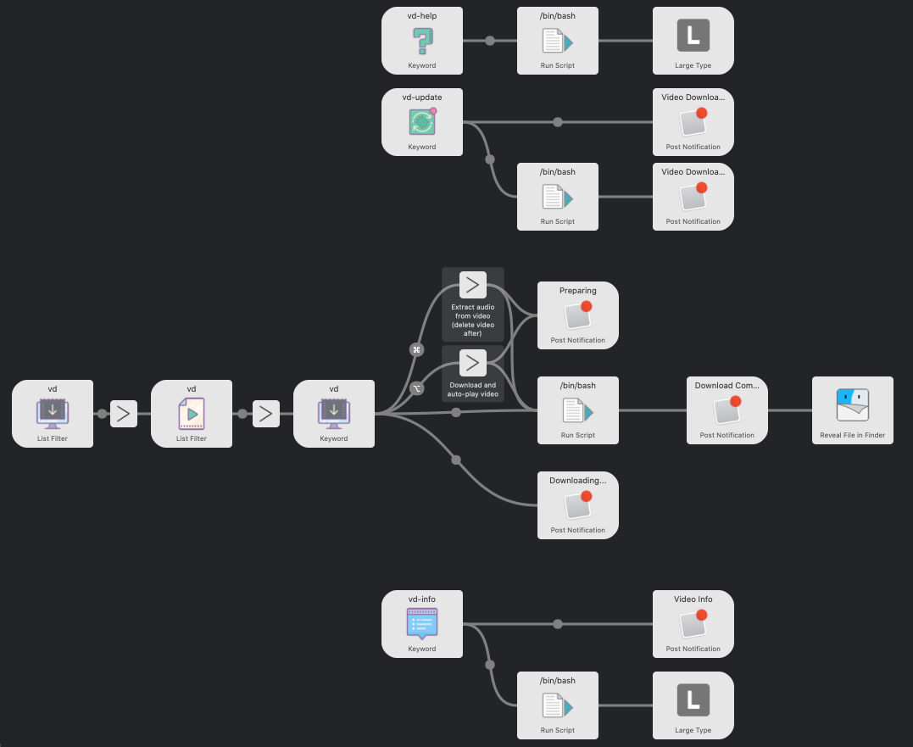
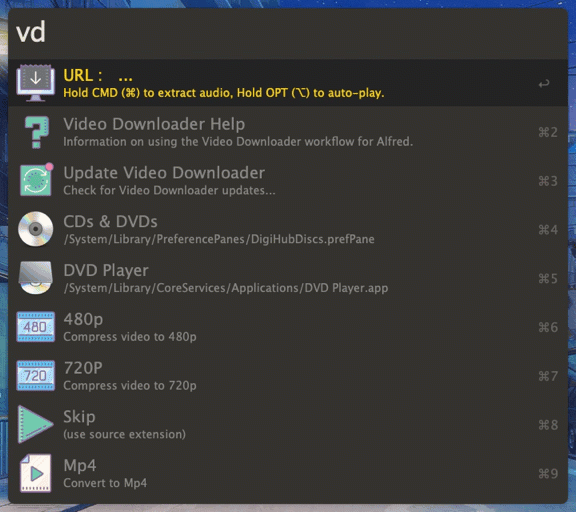

## Video Downloader Alfred (Workflow) ##
Updated Version of Video Downloader (workflow)
Version 1.0 (2020-06-25)

Video Downloader Alfred is an **[Alfred](http://www.alfredapp.com)** workflow written in Bash/Shell for easily downloading videos (and/or extracting audio) from various websites such as YouTube, Vimeo, DailyMotion and more... It uses [youtube-dl](http://rg3.github.io/youtube-dl) as the core component.

## Installation ##
Download and double click [video-downloader-alfred.alfredworkflow](video-downloader-alfred.alfredworkflow). It will be imported into Alfred automatically.

Here is a full visual list of what Video Downloader Alfred can do:



Here is how the workflow nodes look like:



## Usage ##
* `vd-update` will automatically check and update the core component. Run this first when you import the workflow.
* `vd {video-url}` without any option will download the best video+audio option from URL merge then and save the video file to your home folder "\~".
* `vd {video-extension} and/or {video-compression} {video-url}` with this option you can choose compression size and extension (any or both) .



* `vd {video-url} hold ⌘` will download the video file, then automatically extract and create an audio file. (.mp3) (The original video file is deleted at the end)

* `vd {video-url} hold ⌥` will download the video file, then automatic try to play with your default player (VLC, IINA or QT)


* `vd-info {video-url}` will display some video meta-data in Large Type and create an *.info.json* file.
* `vd-help` will display a quick help in Large Type.

### Notes ###
* Videos, audio and meta-data files will be downloaded/created on your folder "\~".
* This workflow will display post notifications where appropriate (before/after downloads, on download errors, updates, etc)...

## Supported Sites ##
    • YouTube
    • Vimeo
    • Dailymotion
    • Twitch
    • MetaCafe
    • Google Video
    • MTV
    • Soundcloud
    • Photobucket Videos
    • DepositFiles
    • blip.tv
    • myvideo.de
    • Google Plus
    • The Daily Show / Colbert Nation
    • The Escapist
    • CollegeHumor
    • arte.tv
    • xvideos
    • infoq
    • mixcloud
    • Stanford Open Content
    • Youku
    • XNXX
    • more...
 list [here](http://rg3.github.io/youtube-dl/documentation.html).

## Requirements ##
* [Python](http://www.python.org) version 2.6, 2.7, or 3.3+
* [FFmpeg](http://www.ffmpeg.org) (optional, required for audio extraction feature)

### Audio Extraction ###
For this feature, you should install FFmpeg yourself manually (because of licensing issues).

One way to install FFmpeg is;

1. Install [XCode](https://developer.apple.com/xcode/)
2. Install [Command Line Tools](https://developer.apple.com/downloads) for Xcode
3. Install [MacPorts](www.macports.org)
4. Install FFmpeg by running the command below in Terminal:

```shell
    $ sudo port install ffmpeg
```

You can append these options to enable support for various codecs and FFmpeg features:

```shell
    +gpl +postproc +lame +theora +libogg +vorbis +xvid +x264 +a52 +faac +faad +dts +nonfree
```

## License ##
**Video Downloader Alfred** workflow is released to the public domain. (Do whatever you like with it.)
*FFmpeg is a trademark of Fabrice Bellard and it is licensed under LGPL version 2.1
http://www.ffmpeg.org/legal.html*
